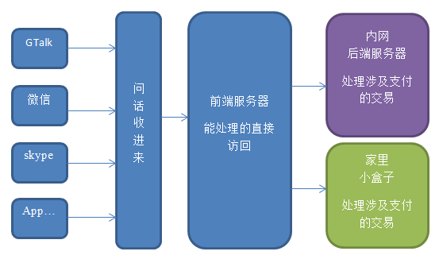

 ExHarbor 开发设想.
==========

ExHarbor(中文：瑞波港湾，缩写：RHB)

宗旨：创建一个基于自然语言交互的易于使用的多币种钱包、支付和交易服务，包括面向各种即时消息（IM）的客户端界面以及对应的后台支撑平台。

即时消息包括但不限于：

面向美国的：

* Google Talk (现改名为Google Hangouts)
* 短信
* 邮件
* facebook chat
* snapshot (待研究，但是青少年里面很火)

面向中国大陆的：

* 微信(wechat)
* QQ
* 短信

特点

* 简单易用
* 去中心化
* 支持任意币种
* 支持多账户
* 基于游戏场景似的用户学习场景设计
* 基于先进密码学的低成本和高安全性

整体架构
----------

用例
----------

### Google hangouts - 初次添加
用户已有Google hangouts帐号，集成在gmail里面，或是手机的hangouts客户端

- 用户添加rippleharbor@gmail.com帐号为好友
- 收到消息

>  Welcome! / 欢迎
>  Send en to keep using English
>  发送cn或"你好"切换到中文

- 发送cn，收到消息

> 欢迎加我为好友。现在开始使用请回复 1，想多了解一点此服务请回复 2。

- 发送1，收到消息

> 为了保证消息能正确送达，请回复您的电子邮箱地址，您将会收到来自rippleharbor@gmail.com的验证码。在下一步回复此验证码，我们将赠送50点积分并为您创建一个空钱包。

- 发送xxx@gmail.com

> 谢谢。验证码已发送到xxx@gmail.com。请检查邮箱并在此回复验证码。

- 发送8899

> 谢谢。您的电子邮件地址已确认。你的钱包地址是...，此钱包需要激活，以下是激活选项：
1 - xxx
2 - bbb
更多选项发送"..."。

- 发送 1， 收到消息

> 