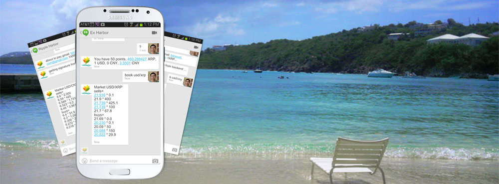
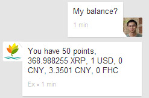
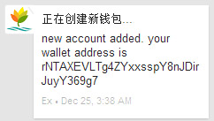
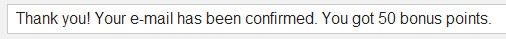

 Nice to meet you in Fortune Harbor 
==========

Digital currency is changing the way of handle and exchange wealth. Are you on board?

Fortune Harbor is a smart chatting service to help you start manage your digital fortune based on the open [Ripple](https://ripple.com) framework and enter the world of next age.

## Features

#### Get started easily

Get to know your new friend in any communication channel including Google Hangouts, Texting, Email, Whatsapp. No registration, no hassle of password.
(*Currently by invitation only.)

#### Talk in your native language and currency

Talk in the way you are the host. Friendly to any currency. This includes existing physical currency and digital currency such as [Bitcoin](Http://bitcoin.org).

#### Free to new account

Free for your first account.

#### Get youself rewarded

You get rewards for completing missions and sending payments.

#### Built in exchange markey

You can exchange to any other currency in the built-in markets.

### [Get started](start.md)

Click [here](start.md) to get started.

---------

Please note this page is inaccurate at this stage and is for your information only. All services are by invitation only and not open to public yet.

---------