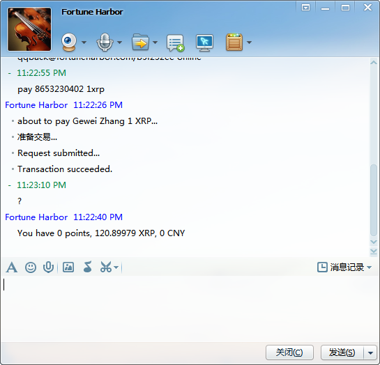

 Getting started
==========

Please note this page is inaccurate at this stage and is for your information only. All services are by invitation only and not open to public yet.

Our service is provided in a variety of channels you are familiar already to reduce your learning curve. Our goal is to let everyone get started in 30 seconds and make your first transaction in 3 minutes.

Texting (SMS)
----------

Texting is supported by all cellphones. This interface is supported in US and Canada only.

- Send "hi" to (865-622-6206) to get started

Email 
----------

Coming soon

- Send "hi" to (fortuneharbor@gmail.com) to get started

Google Talk (Hangouts)
---------

Google Hangouts (formerly Google Talk) is an instant chatting service provided by Google.

- Add fortuneharbor@gmail.com in Hangouts
- Send "hi" to get started
- Follow instructions

QQ
--------

QQ is a popular IM client.

Wechat (Weixin)
--------

Wechat is an emerging IM app.

下一步界面效果

Whatsapp
--------

Coming soon

Important notice
---------

* You must provide a valid email account and US cell phone number to receive free activation provided from us.
* You should care the money in your own pocket. So it is your responsiblity to keep your own accounts secure. For Gmail users, 2-step authentication is strongly recommended.
